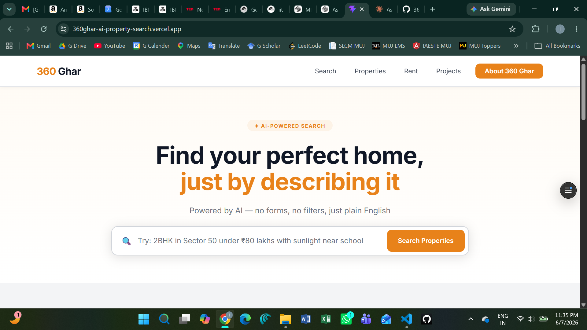

# 360 Ghar AI Property Search Assistant

## Live Demo

**Live Application:** https://360ghar-ai-property-search.vercel.app/

**GitHub Repository:** https://github.com/ijk037/360ghar-ai-property-search

---

## Overview

360 Ghar AI Property Search Assistant is an AI-powered real estate search platform built using React and Vite. The application allows users to discover properties using natural language instead of traditional filters.

Users can describe their ideal home in plain English, and the system intelligently interprets the query to identify relevant properties based on location, budget, property type, and preferences.

This project was developed as part of the 360 Ghar Software Developer Intern Assignment.

---

## Features

### Natural Language Property Search

Search using conversational queries such as:

> "2BHK in Sector 50 under 80 lakhs with good sunlight near school"

The application extracts relevant information including:

* BHK configuration
* Budget range
* Preferred location
* Amenities and preferences
* Search intent

---

### Smart Property Discovery

Users can browse a curated dataset of Gurgaon properties and instantly view matching results.

Each property card displays:

* Property image
* Property type
* Area
* Location
* Price
* Match score
* Quick property insights

---

### Property Detail Modal

Clicking a property opens a detailed modal containing:

* Larger property image
* Key property specifications
* Area and location details
* Property highlights
* Personalized property summary

---

### AI-Assisted Experience

The application integrates OpenRouter LLMs to:

* Parse natural language queries
* Generate structured search filters
* Improve property relevance
* Provide personalized recommendations

---

### Modern Responsive UI

The interface was designed using Figma and implemented using React with Styled Components.

Features include:

* Responsive layout
* Modern card-based design
* Interactive property modal
* Clean navigation
* Professional visual hierarchy

---

## Screenshots

### Home Page

Natural language property search interface with AI-powered query input.



### Search Results

AI-assisted property matching and recommendations.


### Property Details Modal

Detailed property view with property insights and recommendations.


---

## Tech Stack

### Frontend

* React
* Vite
* JavaScript (ES6+)
* Styled Components

### AI Integration

* OpenRouter API
* Google Gemma 3 27B Instruct

### Development Tools

* Git
* GitHub
* Vercel

---

## Model Choice

### google/gemma-3-27b-it:free

This model was selected because it provides:

* Strong instruction following
* Reliable structured JSON generation
* Good natural language understanding
* Fast inference for search parsing tasks

The model is used to transform natural language property requirements into structured filters that can be processed by the application.

---

## Project Architecture

### Components

* SearchBar
* PropertyCard
* PropertyModal
* MatchBadge
* FollowUpQuestion

### Utilities

* Query Parsing
* Property Filtering
* Property Ranking
* AI Summary Generation

### Data Layer

* Mock Gurgaon Property Dataset

---

## Skills Demonstrated

This project demonstrates:

* React Component Architecture
* State Management with React Hooks
* API Integration
* Prompt Engineering
* Responsive UI Development
* Styled Components
* Natural Language Query Processing
* Frontend Application Deployment
* Git Version Control

---

## Setup Instructions

### 1. Clone Repository

```bash
git clone https://github.com/ijk037/360ghar-ai-property-search.git
```

### 2. Navigate Into Project

```bash
cd 360ghar-ai-property-search
```

### 3. Install Dependencies

```bash
npm install
```

### 4. Create Environment File

Create a `.env` file in the root directory:

```env
VITE_OPENROUTER_KEY=your_openrouter_api_key
```

### 5. Start Development Server

```bash
npm run dev
```

### 6. Build Production Version

```bash
npm run build
```

---

## Prompt Engineering Notes

Several prompt design strategies were tested during development:

* Strict JSON-only output formatting
* Structured filter extraction prompts
* Controlled response schemas
* Markdown removal before parsing
* Short and focused summary generation prompts

Structured prompting produced significantly more reliable and consistent filtering results compared to free-form prompting.

---

## Deployment

The application is deployed on Vercel:

**https://360ghar-ai-property-search.vercel.app/**

Deployment pipeline:

GitHub → Vercel → Automatic Production Builds

---

## Future Improvements

Potential future enhancements include:

* Property comparison engine
* Interactive property maps
* Saved properties and wishlists
* User authentication
* Real estate backend integration
* Advanced recommendation engine
* 360° virtual property tours

---

## Author

**Ishpreet Kaur**

Built as part of the 360 Ghar Software Developer Intern Assignment.
